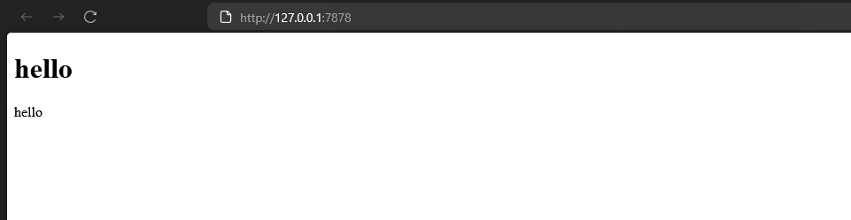
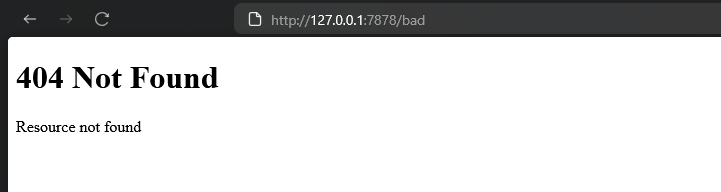

# Reflection Notes

## Reflection 1
The `handle_connection` function in the code processes incoming TCP connections from a web client. It takes a mutable TcpStream as input, representing the connection to a client. It creates a buffered reader around the stream for more efficient line by line reading, and reduces system calls. It then processes the HTTP request, reading the input stream liine by line, returning Result for each line and mapping each Result , continuing until it hits an empty line, and collects all lines into a vector. It then outputs the recieved HTTP request to the console using a pretty-print format.

## Reflection 2

## Reflection 3
The refactoring is needed because the code in the if-else blocks are repetive (reading lines). We split between requests by looking at the response (200 OK vs 404 NOT FOUND)

## Reflection 4
The second request was completely blocked until the first request (sleep) finishes processing. This happens because the server is single-threaded and proesses requests sequentially. The stream loop handles one connection at a time.
